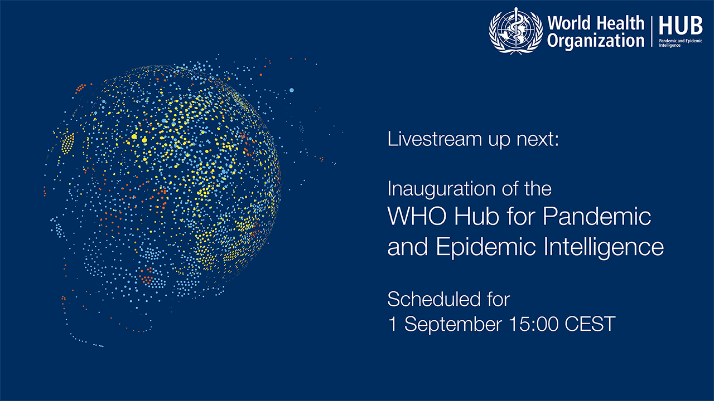
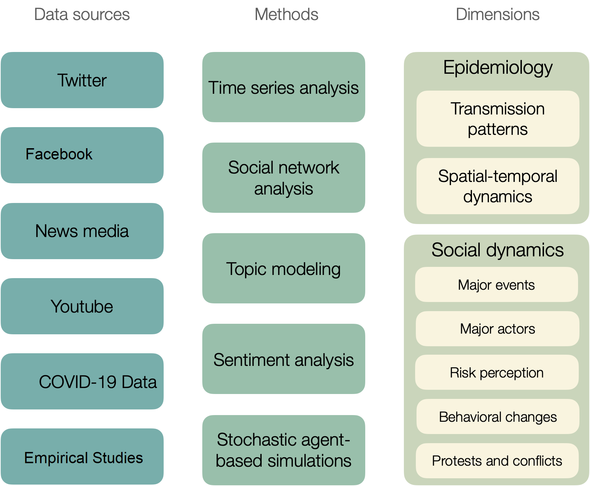
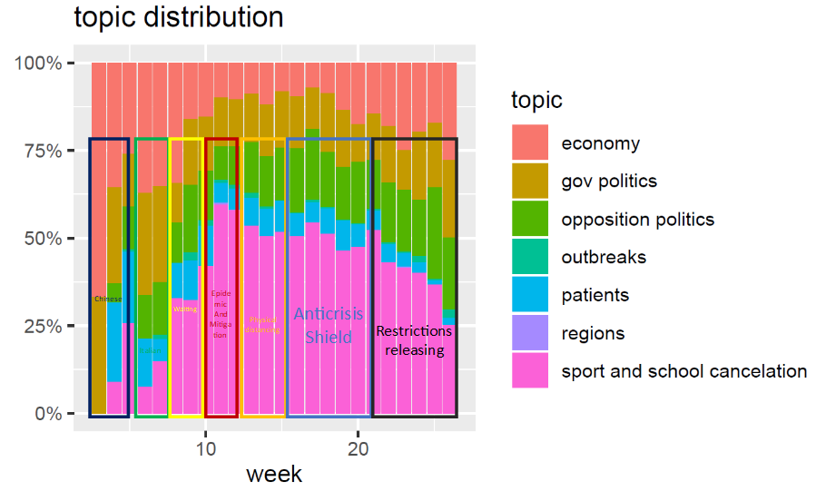
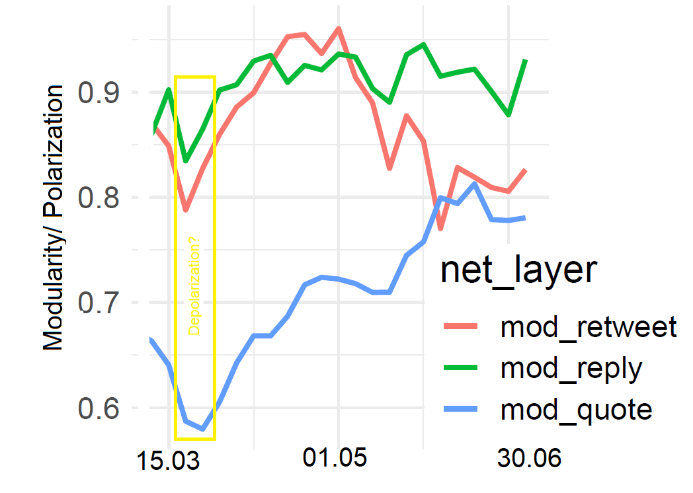
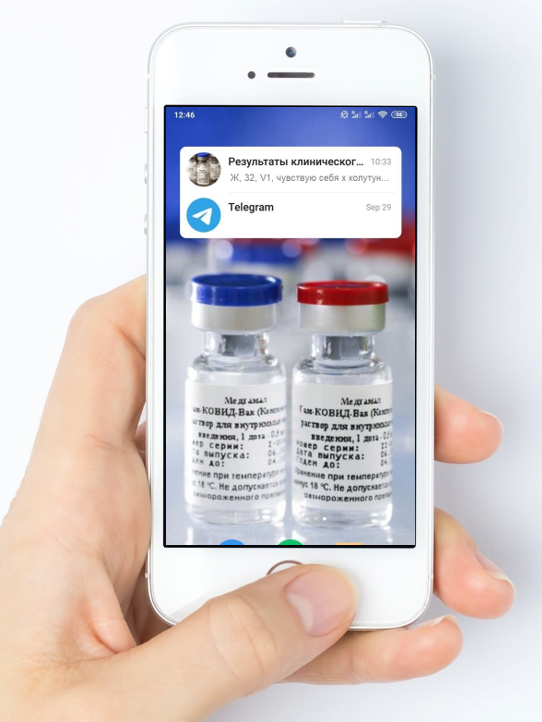
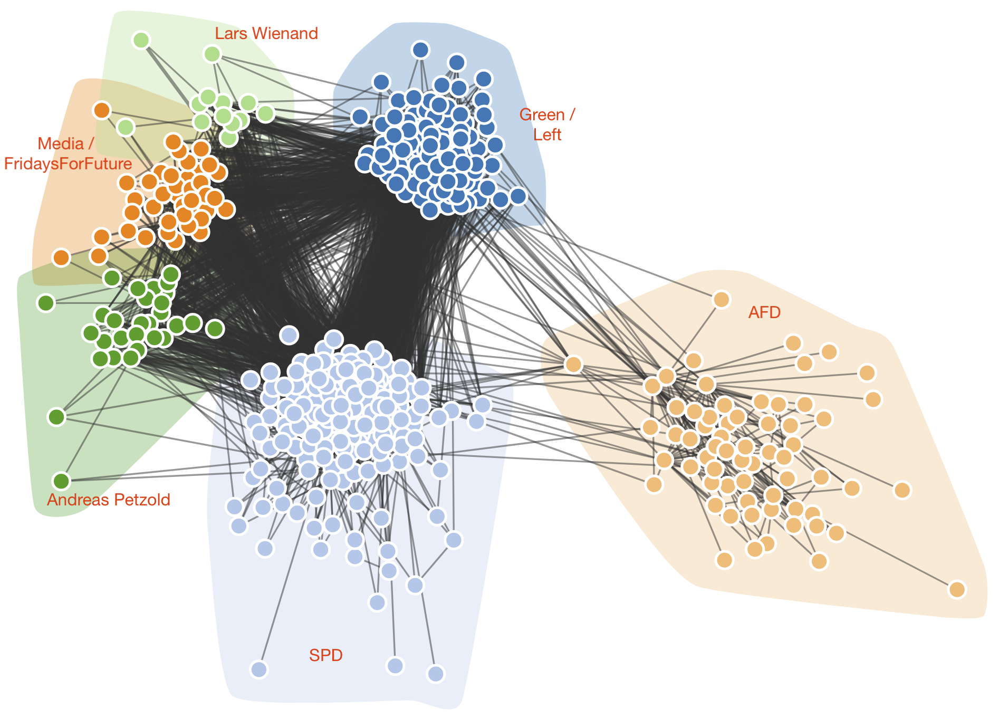

# Outline

\Large
\pause

 1) Introduction to infodemiology (the traditional and social-content media on the Internet in pandemic)
 
 2) Examples then infodemiology supporting and supplementing traditional public health repertoire

 3) Examples then infosurvelliance could supress traditional medical reasearch (clinical trials and registries) 

 4) Roadmap for analysis of German Internet


\large

\pause


# Infodemic

- traditional vs social-content media 
- a concept in the social medicine area: "lay-referral framing system" where opinions and beliefs of the general public are something different from medical knowledge. 
- information is widely treated as a trigger of consequences  impacting daily-life security
- participatory epidemiology


# History of Infodemiology and infosurvelliance

- Google Flu Trends (2010) - syndromic infosurvelliance using ILI keywords.  

- Infosurvelliance in prediction/forecasting COVID-19 infection dynamics worked far below expectation in Europe for publicly availabe dataset (i.e. Lampos, Vasileios, et al. "Tracking COVID-19 using online search." NPJ digital medicine 4.1 (2021): 1-11.), but seems to work with much more precised dataset in China (i.e. Guo, Shuhui, et al. "Improving Google flu trends for COVID-19 estimates using Weibo posts." Data Science and Management 3 (2021): 13-21.) 

- High expectation, little predictive power (low digitalization rates and lack of availability of individual records in Western societies?)

# Infodemiology as supporting tool for public health

-  Meassuring the social interest in/around SARS-CoV-2 and COVID-19 in the
Internet media during the epidemic 

- Quantifing dynamics of interest (demand and supply of content) and discourse patterns.

- Internet as a digital footprint of social activities (secondary document analysis)

- Media Analysis of the social proceses. SEO-marketing solutions as SentiOne (used by Infodemic menagment by WHO)

- Serves as a complement to longitudinal surveys monitoring
public perception (and other socio-economic methods) in REAL TIME


# WHO Infodemiological intelligence

Part of Hub for Pandemic and Epidemic Intelligence in Berlin


```{r, WHO, out.width="0.7\\linewidth", include=TRUE, fig.align="center",  echo=F}

```


https://www.who.int/news/item/01-09-2021-who-germany-open-hub-for-pandemic-and-epidemic-intelligence-in-berlin 


# Methodologies and goels 


```{r, sdsds2, dpi = 600,fig.align="center",echo = F, out.width="70%"}


```
Scheme of the proposed infodemiological project, We aim to infer the interplay between social dynamics as revealed via Internet media and epidemiology  of COVID-19 (only major data sources are shown) deploying the methods presented.

# Think globally, act locally
- What? (content (key vocabulary, topics and sentiment) as on risk communication, fake news etc.)
- Who? (categories of  senders of information, Who are main actors and communities in discourse) 
- When? (timeline, how does perception of disease evolve?),
- Where? (geography, cross-regional comparison)
-  How? (providing new information or blocking existing channels, Which factors affect risk perception and adherence to NPI?)


# Outline

\Large
\pause

 1) Introduction to infodemiology (the traditional and social-content media on the Internet in pandemic)
 
 **2) Examples then infodemiology supporting and supplementing traditional public health repertoire**

 3) Examples then infosurvelliance could supress traditional medical reasearch (clinical trials and registries) 

 4) Roadmap for analysis of German Internet


\large

\pause


# Topic Modelling of News in Poland

Social aspects are dominating!

```{r, topic, dpi = 600,fig.align="center",echo = F, out.width="100%"}


```
Weekly dynamics of media perception in Poland. Main Topics in over 50 thousand news articles (without garbage codes).

# Interest in "Coronavirus" in Poland (multiple media source)


```{r, 33, out.width="0.5\\linewidth", include=TRUE, fig.align="center",  echo=F}
knitr::include_graphics('phases.pdf')
```
Jarynowski, Andrzej, Monika Wójta-Kempa, and Vitaly Belik. "Trends in interest of COVID-19 on Polish Internet." Epidemiol Rev 74 (2020): 258-275.

# Polarization in Polish Twitter

The (de-)polarization (revealed by modularity and sentiment analysis)
```{r, twi2, out.width="0.5\\linewidth", include=TRUE, fig.align="center", echo=F}


```
Modularity of the full networks (over 30 thousands accounts) and their
weekly dynamics for different type of communication relations (retweeting, reply, quotation).


Jarynowski, Andrzej, et al. "Social Cohesion During the Stay-at-Home Phase of the First Wave of the COVID-19 Pandemic on Polish-Speaking Twitter." LNCS in press (2021).


# Outline

\Large
\pause

 1) Introduction to infodemiology (the traditional and social-content media on the Internet in pandemic)
 
 2) Examples then infodemiology supporting and supplementing traditional public health repertoire

 **3) Examples then infosurvelliance could supress traditional medical reasearch (clinical trials and registries) **

 4) Roadmap for analysis of German Internet


\large

\pause


# Sputnik V


```{r, sputnik, out.width="0.7\\linewidth", include=TRUE, fig.align="center",  echo=F}

```


# Outline

\Large
\pause

 1) Introduction to infodemiology (the traditional and social-content media on the Internet in pandemic)
 
 2) Examples then infodemiology supporting and supplementing traditional public health repertoire

 3) Examples then infosurvelliance could supress traditional medical reasearch (clinical trials and registries) 

**4) Roadmap for analysis of German Internet **


\large

\pause


# Protest in Berlin (Twitter)

 We have collected tweets in German language with hashtags B0108 (92,474) and B2908 (345,992) for both main demonstrations on August 1st and August 29th, 2020 in Berlin.

For Twitter data we can deploy the temporal network analysis of users (here retweets), and simple NLP.

Jarynowski, Andrzej, Alexander Semenov, and Vitaly Belik. "Protest perspective against COVID-19 risk mitigation strategies on the German Internet." International Conference on Computational Data and Social Networks. Springer, Cham, 2020.


# Protest in Berlin (01.08.2020) on Twitter
```{r, pro_pl_1, dpi = 600,fig.align="center",echo = F, out.width="85%"}

```
We observe such a mosaic pattern in German protests when representatives of AfD party as well as the SPD and the Green parties were connected on the retweet network during 01.08.2020 Berlin protests with hashtag b0108

# Protest in Berlin (29.08.2020) on Twitter
```{r, pro_pl_2, dpi = 600,fig.align="center",echo = F, out.width="95%"}
knitr::include_graphics('b29_flow_.pdf')
```
Flow of users between communities with the biggest communities on the retweet network. Codes for the main identified communities: 1 – SPD and mainstream (anti-protest); 5 – Antifa (anti-protest); 7– AfD (pro-protest); 4 – community of left-wing liberals (anti-protest); 13 – liberal and more acceptable to protests


# Vaccine context on German Twitter


Net of hashtags and actors

# Conclusions

- The COVID-19 epidemic in the Internet is primarily of a social, not medical, dimension;

- Role Social media in driving social processes doesn't need to be always negative; 

- Infodemiology **is very usefull** in understanding social dynamics during pandemic a supplementary role to standard tools as surveys; 

- Infosurvelliance **could be usefull** for public health decision makers in some specific areas too. 

